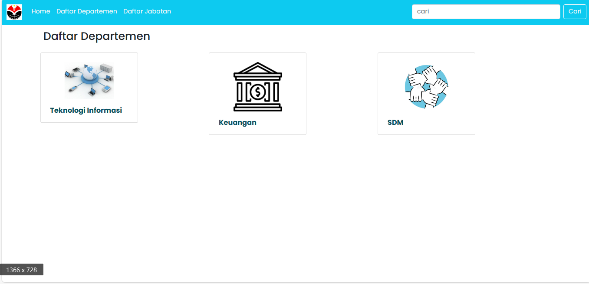

## TP3DPBO2024C2
Saya Nabilla Assyfa Ramadhani [2205297] mengerjakan TP3 dalam mata kuliah Desain dan Pemograman Berorientasi Objek, untuk keberkahanNya maka saya tidak melakukan kecurangan seperti yang telah dispesifikasikan. Aamiin

# Desain Database

Database ini terdiri dari 4 tabel utama : `Karyawan`, `Departemen`, `Jabatan`, dan `Status`.  Tabel karyawan memiliki hubungan one-to-one dengan tabel lainnya. Setiap karyawan memiliki satu departemen, satu jabatan, dan satu status.

# Desain Program
Program ini menggunakan bahasa PHP yang terhubung dengan sebuah database. Program ini dapat melakukan CRUD. Adapun kelas-kelas yang digunakan dalam program ini antara lain:
1. **Folder assets** : Digunakan untuk menyimpan foto yang diunggah oleh pengguna.
2. **Folder Classes** : Digunakan untuk menyimpan kelas - kelas dalam program. Kelas - kelas yang digunakan antara lain: 
    - **`DB.php`** : Digunakan untuk berinteraksi dengan database.
    - **`Departemen.php`** : Digunakan untuk menampung fungsi - fungsi yang digunakan untuk data departemen pada website.
    - **`Jabatan.php`** : Digunakan untuk menampung fungsi - fungsi yang digunakan untuk data jabatan pada website.
    - **`Karyawan.php`** : Digunakan untuk menampung fungsi - fungsi yang digunakan untuk data karyawan pada website.
    - **`Status.php`** : Digunakan untuk menampung fungsi - fungsi yang digunakan untuk data status pada website.
    - **`Template.php`** : Digunakan untuk membaca, menulis dan memanipulasi file teks.
3. **Templates** : Digunakan untuk menyediakan kerangka dasar. Adapun template yang digunakan antara lain :
    - **`Skin.html`** : Digunakan untuk template tampilan halaman utama
    - **`Skinform.html`** : Digunakan untuk template pada form `ubah`, `tambah`, dan `detail`.
    - **`Skintabel.html`** : Digunakan untuk template pada halaman `departemen` dan `jabatan`.
4. **`departemen.php`** : Digunakan untuk menampilkan data depertemen, serta melakukan proses CRUD.
5. **`detail.php`** : Digunakan untuk menampilkan detail data karyawan.
6. **`index.php`** : Digunakan sebagai halaman utama untuk menampilkan data departemen.
7. **`jabatan.php`** : Digunakan untuk menampilkan data jabatan, serta melakukan proses CRUD.
8. **`karyawan.php`** : Digunakan untuk menampilkan data karyawan yang bekerja pada suatu departemen.
9. **`tambah.php`** : Form dan aksi untuk menambah data karyawan
10. **`ubah.php`** : Form dan aksi untuk mengubah data karyawan.
 

# Alur Program
### Departemen
1. Saat pengguna menekan tombol "Daftar departemen", program akan menampilkan data departemen yang tersedia dalam database.
2. Jika pengguna menekan tombol "Tambah departemen", program akan menampilkan formulir untuk menambahkan data baru.
    - Pengguna diminta untuk mengisi nama departemen dan mengunggah foto departemen.
    - Setelah memastikan semua field terisi, pengguna dapat menekan tombol "Tambah".
    - Data departemen yang dimasukkan oleh pengguna akan ditambahkan ke dalam database.
3. Jika pengguna menekan ikon untuk mengubah data, program akan menampilkan formulir untuk mengubah data.
    - Pengguna dapat melakukan modifikasi pada data yang ingin diubah.
    - Setelah selesai melakukan perubahan, pengguna dapat menekan tombol "Ubah" untuk menyimpan perubahan tersebut.
4. Jika pengguna menekan ikon untuk menghapus data, program akan menampilkan konfirmasi untuk menghapus data.
    - Jika pengguna mengkonfirmasi penghapusan, data akan dihapus dari database.

### Jabatan
1. Saat pengguna menekan tombol "Daftar jabatan", program akan menampilkan data jabatan yang tersedia dalam database.
2. Jika pengguna menekan tombol "Tambah jabatan", program akan menampilkan formulir untuk menambahkan data baru.
    - Pengguna diminta untuk mengisi nama jabatan.
    - Setelah memastikan field terisi, pengguna dapat menekan tombol "Tambah".
    - Data jabatan yang dimasukkan oleh pengguna akan ditambahkan ke dalam database.
3. Jika pengguna menekan ikon untuk mengubah data, program akan menampilkan formulir untuk mengubah data.
    - Pengguna dapat melakukan modifikasi pada data yang ingin diubah.
    - Setelah selesai melakukan perubahan, pengguna dapat menekan tombol "Ubah" untuk menyimpan perubahan tersebut.
4. Jika pengguna menekan ikon untuk menghapus data, program akan menampilkan konfirmasi untuk menghapus data.
    - Jika pengguna mengkonfirmasi penghapusan, data akan dihapus dari database.

### Karyawan
1. Saat pengguna menekan salah satu departemen, program akan menampilkan data karyawan yang bekerja pada departemen tersebut.
2. Jika pengguna menekan salah satu data karyawan, maka akan masuk kedalam halaman detail untuk menampilkan detail data karyawan.
3. Jika pengguna menekan tombol "Tambah karyawan", program akan menampilkan formulir untuk menambahkan data baru.
    - Pengguna diminta untuk mengisi nama karyawan, jenis kelamin, tahun masuk, besar gaji, departemen karyawan, jabatan karyawan, status karyawan dan mengunggah foto karyawan.
    - Setelah memastikan semua field terisi, pengguna dapat menekan tombol "Tambah".
    - Data karyawan yang dimasukkan oleh pengguna akan ditambahkan ke dalam database.
4. Jika pengguna menekan tombol "Ubah" untuk mengubah data, program akan menampilkan formulir untuk mengubah data.
    - Pengguna dapat melakukan modifikasi pada data yang ingin diubah.
    - Setelah selesai melakukan perubahan, pengguna dapat menekan tombol "Ubah" untuk menyimpan perubahan tersebut.
5. Jika pengguna menekan tombol "Hapus" untuk menghapus data, program akan menampilkan konfirmasi untuk menghapus data.
    - Jika pengguna mengkonfirmasi penghapusan, data akan dihapus dari database.

# Dokumentasi Program
## Beranda (tampilan awal)

## Data Departemen
Dapat melakukan pengurutan secara ascending maupun descending, pencarian data dapat dilakukan untuk mencari data departemen.
### Menampilkan data

### Menambahkan data

### Mengubah data

### Menghapus data

## Data Jabatan
Dapat melakukan pengurutan secara ascending maupun descending, pencarian data dapat dilakukan untuk mencari data jabatan.
### Menampilkan data

### Menambahkan data

### Mengubah data

### Menghapus data

## Data Karyawan
Dapat melakukan pencarian data karyawan yang bekerja pada departemen tersebut.
### Menampilkan data

### Menampilkan detail data pegawai

### Menambahkan data

### Mengubah data

### Menghapus data
